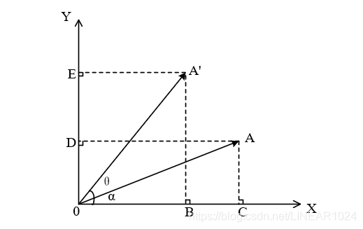

# 平面向量旋转

平面中，向量旋转后的新向量如何用原向量表示？

单位向量旋转一个角度后得到新向量，向量表示为：

$$
\begin{aligned}
        \vec{x}_b
    &=
        \vec{x}_b
        \cdot
        \vec{x}_a
    +
        \vec{x}_b
        \cdot
        \vec{x}_{a\perp}
    \\
    &=
        \vec{x}_a
        \cdot
        cos(\theta)
    +
        \vec{x}_{a\perp}
        \cdot
        sin(\theta)
\end{aligned}
$$

用坐标表示为：

$$
\begin{aligned}
        \left[
            \begin{matrix}
                x_b
                \\
                y_b
            \end{matrix}
        \right]
    &=
        \left[
            \begin{matrix}
                x_a
                \\
                y_a
            \end{matrix}
        \right]
    \cdot
        c
    +
        \left[
            \begin{matrix}
                - y_a
                \\
                x_a
            \end{matrix}
        \right]
    \cdot
        s
    \\
    &=
    \left[
            \begin{matrix}
                c & - s
                \\
                s & c
            \end{matrix}
        \right]
    \cdot
        \left[
            \begin{matrix}
                x_a
                \\
                y_a
            \end{matrix}
        \right]
\end{aligned}
$$
